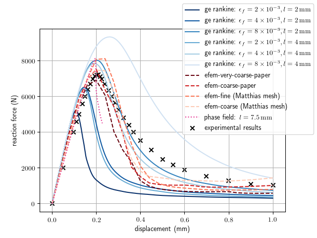

# lShapedPanelBenchmark

Benchmark for the comparison of 
 - phase field cracking, 
 - finite elements with embedded discontinuities and 
 - gradient-enhanced damage-plasticity (rankine) 
 
 based on the experimental tests by Winkler et. al on a L-shaped concrete panel.

